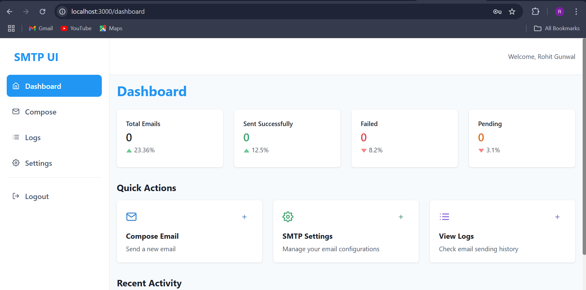
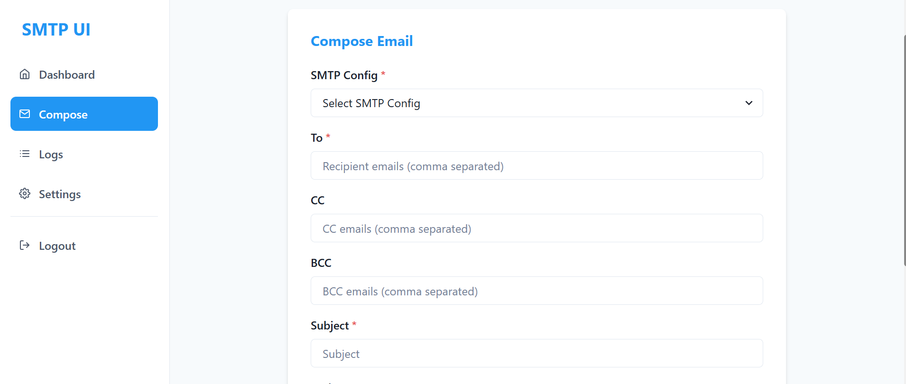
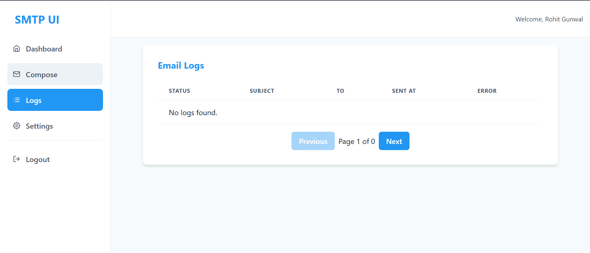

# SMTP UI

SMTP UI is a secure, privacy-focused email management system built with the MERN stack (MongoDB, Express, React, Node.js). It allows users to manage multiple SMTP configurations, compose and send emails (with attachments), and view detailed logs of sent emails—all from a modern, user-friendly web interface. All email credentials and data are stored securely and processed locally, ensuring user privacy.

---

## Features

- **User Authentication:** Register and login securely.
- **SMTP Configuration:** Add, test, and manage multiple SMTP server settings.
- **Compose Emails:** Send emails with support for CC, BCC, HTML body, and file attachments.
- **Email Logs:** View logs of sent, failed, and pending emails with filtering and pagination.
- **Statistics Dashboard:** Visualize email sending statistics.
- **Privacy & Security:** All sensitive data is stored securely and processed on your own server.

---

Dashboard

Compose Mails

Logs


---

## Tech Stack

- **Frontend:** React, Chakra UI, React Hook Form, React Router, React Icons, React Quill, Vite
- **Backend:** Node.js, Express, MongoDB, Mongoose, Nodemailer, JWT, Multer
- **Other:** Docker (optional), Helmet, CORS, dotenv

---

## Getting Started

### Prerequisites

- [Node.js](https://nodejs.org/) (v18+ recommended)
- [npm](https://www.npmjs.com/) (comes with Node.js)
- [MongoDB](https://www.mongodb.com/) (local or Atlas cluster)

---

### 1. Clone the Repository

```sh
git clone <repo-url>
cd "SMTP UI"
```

### 2.Install Dependencies

This project uses a monorepo structure with separate client and server folders.

```
npm run install-all
```

### 3. Configure Environment Variables

Copy `.env.example` to`.env`in the server and client folder respectively.

### 4.Start the Application

```
 npm run dev
```

Backend will run on http://localhost:5000
Frontend will run on http://localhost:3000

### Usage

- Register a new account.
  Login with your credentials.
- Add SMTP Configurations in the Settings page.
- Test your SMTP settings before using them.
- Compose and send emails from the Compose page.
- View Logs and statistics on the Dashboard and Logs pages.
